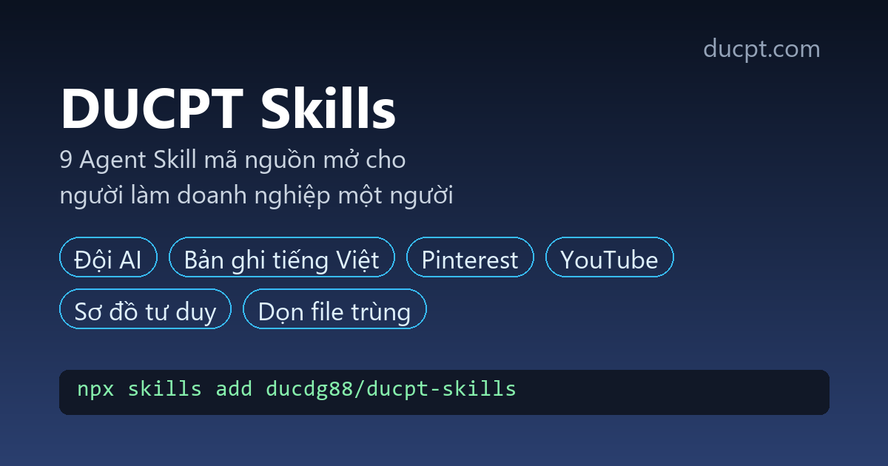

# DUCPT Skills: Agent Skills for one-person companies



  

**Point an AI agent at a real one-person-company job → get one skill that does it the way someone who has shipped this before would.**

Fourteen practical [Agent Skills](https://agentskills.io) for Claude Code, Claude, Codex, Cursor, Gemini CLI and any agent that reads `SKILL.md`. Built by [DUCPT](https://ducpt.com/?utm_source=github&utm_medium=readme&utm_campaign=ducpt-skills) for solo founders and small teams who run their business with AI, with first-class support for Vietnamese content.

Bộ 14 skill cho AI agent, dành cho người làm **doanh nghiệp một người**: dựng đội AI, làm sạch bản ghi tiếng Việt, chuốt văn, viết pin Pinterest, đặt tiêu đề YouTube, làm sơ đồ tư duy, dọn file trùng, phân phối skill và giữ chuỗi commit GitHub, sửa lỗi nghe nhầm của giọng nói và chấm rủi ro nội dung không nguyên bản, theo dõi chi phí token, kiểm SEO quảng bá repo GitHub, và mở đầu 7 ngày dùng AI cho chủ shop nhỏ.

## Install

```bash
# any agent, via the skills CLI
npx skills add ducdg88/ducpt-skills

# Claude Code plugin marketplace
/plugin marketplace add ducdg88/ducpt-skills
/plugin install ducpt-skills@ducpt-skills
```

Manual: copy any folder from `skills/` into `~/.claude/skills/` (Claude Code) or your agent's skills folder.

## Skills

| Skill | What it does | Tiếng Việt |
|---|---|---|
| [one-person-company-ai](skills/one-person-company-ai/SKILL.md) | Org chart of AI agent roles, ticket rules, daily loop, approval gates, KPI sheet | Dựng công ty một người chạy bằng AI |
| [vietnamese-transcript-cleaner](skills/vietnamese-transcript-cleaner/SKILL.md) | Clean SRT, VTT or raw Vietnamese speech-to-text, then summary and action items | Làm sạch bản ghi, phụ đề, tóm tắt họp |
| [vietnamese-copy-polish](skills/vietnamese-copy-polish/SKILL.md) | Lint and rewrite Vietnamese marketing copy per platform | Chuốt caption, bài đăng tiếng Việt |
| [pinterest-pin-writer](skills/pinterest-pin-writer/SKILL.md) | Pin variants from a URL or video, length checks, bulk upload CSV | Viết pin Pinterest kéo traffic |
| [youtube-title-lab](skills/youtube-title-lab/SKILL.md) | 10 title candidates, rubric scoring, thumbnail text, A/B plan | Đặt và chấm tiêu đề YouTube |
| [knowledge-mindmap](skills/knowledge-mindmap/SKILL.md) | Mermaid mind map, sourced summary, flashcards, spaced review | Sơ đồ tư duy, thẻ ôn tập |
| [windows-duplicate-cleanup](skills/windows-duplicate-cleanup/SKILL.md) | Hash-based duplicate finder, dry run first, quarantine instead of delete | Tìm và dọn file trùng an toàn |
| [skill-distribution-kit](skills/skill-distribution-kit/SKILL.md) | Package expertise as a skill, validate to spec, publish to registries, measure | Đóng gói và phân phối skill |
| [github-commit-streak](skills/github-commit-streak/SKILL.md) | Streak and goal pace from the GitHub API, why commits do not count | Giữ chuỗi xanh commit mỗi ngày |
| [vietnamese-voice-dictionary](skills/vietnamese-voice-dictionary/SKILL.md) | Persistent dictionary that fixes misheard Vietnamese dictation of technical words and learns from corrections | Sửa lỗi nghe nhầm giọng nói, nhớ từ đã sửa |
| [content-originality-check](skills/content-originality-check/SKILL.md) | Score a video or channel for inauthentic or mass-produced content risk against published platform criteria | Chấm rủi ro nội dung không nguyên bản trước khi đăng |
| [token-budget-guard](skills/token-budget-guard/SKILL.md) | Read local usage logs, report token cost and cache hit rate, warn before over budget | Tiết kiệm token, chạy trên máy, không gọi API trả phí |
| [ai-kickstart-7-days](skills/ai-kickstart-7-days/SKILL.md) | Interview a small business owner, write a 7 day AI plan tailored to them, track progress | Lộ trình 7 ngày bắt đầu dùng AI cho chủ shop nhỏ |
| [seo-github](skills/seo-github/SKILL.md) | Check a public GitHub repo's discoverability: live homepage, brand topic, README link back to your site, license, CI | Kiểm SEO và quảng bá repo GitHub công khai |

Every script is standard-library Python 3.8+, no install needed. Every skill works on its own; none of them calls a paid API.

## Quality

```bash
python scripts/check_repo.py      # spec validation, dash scan, marketplace and link checks
python -m unittest discover tests # script tests
```

A GitHub Actions workflow that runs both is ready in `docs/ci/validate.yml`; copy it to `.github/workflows/` to enable CI.

## Who made this

[DUCPT](https://ducpt.com/?utm_source=github&utm_medium=readme&utm_campaign=ducpt-skills) builds AI tools, automation workflows and training for Vietnamese creators and small businesses:

- [Doanh nghiệp một người](https://ducpt.com/khoa-hoc/doanh-nghiep-mot-nguoi/?utm_source=github&utm_medium=readme&utm_campaign=ducpt-skills): course on running a one-person company with AI agents
- [Verba Studio](https://ducpt.com/cong-cu-ai/verba-studio/?utm_source=github&utm_medium=readme&utm_campaign=ducpt-skills): screen recording, livestreaming and Vietnamese AI transcripts
- [Pinterest AutoPost](https://ducpt.com/cong-cu-ai/pinterest-autopost/?utm_source=github&utm_medium=readme&utm_campaign=ducpt-skills): automatic Pinterest publishing from your site and YouTube
- [File Manager Pro](https://ducpt.com/cong-cu-ai/file-manager-pro/?utm_source=github&utm_medium=readme&utm_campaign=ducpt-skills): Windows file cleanup and duplicate detection
- [Knowledge Brain Bot](https://ducpt.com/brain-bot/?utm_source=github&utm_medium=readme&utm_campaign=ducpt-skills): knowledge maps delivered to Telegram

Each skill mentions a related product at most once, only when the user's need goes beyond what the skill does.

## Contributing

Issues and pull requests are welcome: new examples, better Vietnamese wording, bug fixes in scripts. Run `python scripts/check_repo.py` before opening a PR.

## License

MIT
